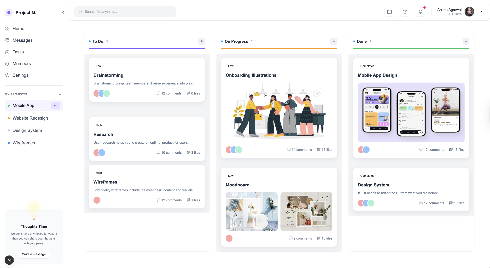

# Web App Dashboard

## 📌 Overview

This project implements a **Web App Dashboard** using modern web development tools and best practices.  
The dashboard is designed with a clean and responsive layout, following pixel-perfect UI guidelines.

---

## 🚀 Features

- **Responsive Layout** – Works on desktop and mobile devices.
- **Sidebar Navigation** – Organized navigation links for quick access.
- **Topbar / Header** – Includes title, action buttons, and user profile section.
- **Dashboard Widgets** – Displays key metrics and data cards.
- **Pixel-perfect UI** – Styled to match the provided design specifications.

---

## 🛠️ Tech Stack

- **React** – Frontend framework
- **Next.js** – Routing and page management
- **TypeScript** – Static typing for maintainable code
- **Tailwind CSS** – Utility-first styling
- **Heroicons** – Icons for UI elements

---

## ⚙️ Installation & Setup

### 1️⃣ Clone the Repository

```bash
git clone https://github.com/NikooNasrpooya/WebAppDashboard.git
cd WebAppDashboard
```

### 2️⃣ Install Dependencies

```bash
npm install
```

### 3️⃣ Run Development Server

```bash
npm run dev
```

Your app will be running at **http://localhost:3000**

### 4️⃣ Build for Production

```bash
npm run build
npm run start
```

---

## 🧠 How It Works

The **Web App Dashboard** is designed with a **modular and scalable architecture**:

1. **Layout System**

   - A main layout file wraps all pages with a consistent **Sidebar** and **Topbar**.
   - This ensures the navigation and header remain persistent across pages.

2. **Sidebar Navigation**

   - Built with **flex and Tailwind utilities** for alignment.
   - Uses **Heroicons** for icons.
   - Links are mapped from an array to make it easy to add, remove, or reorder.

3. **Topbar**

   - Contains the page title, action buttons, and a user profile area.
   - Styled to stay fixed at the top with shadow for separation.

4. **Dashboard Widgets**

   - Each widget is a **reusable component**.
   - Accepts props for title, value, icon, and trend (e.g., up/down arrow).
   - Designed with a **responsive grid** layout so they stack on smaller screens.

5. **Styling**
   - Fully styled with **Tailwind CSS** for quick iteration and consistency.
   - **Custom colors** are defined in `tailwind.config.ts` to match the provided design.

---

**Flow:**

- **Layout.tsx** wraps all pages with **Sidebar** and **Topbar**.
- Inside the layout, the **Dashboard Page** is rendered, containing widgets, charts, and other data visualizations.
---

## 📸 App Screenshot:



## 📸 App Link:
https://web-app-dashboard-git-main-nikoo-nasrpooyas-projects.vercel.app/